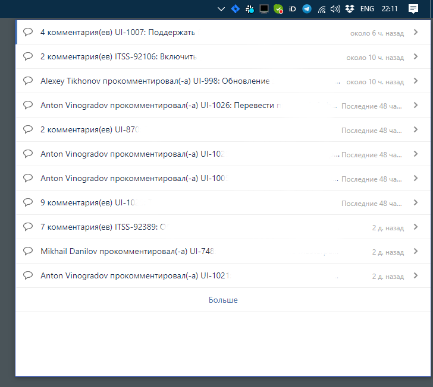
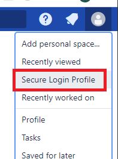
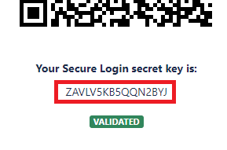

# Confluence/Jira tray notify

Show [Confluence Workbox Notifications](https://confluence.atlassian.com/doc/workbox-notifications-284365963.html) in the tray.



## Setup

Place config in `~/.confluence-notify` with content:

```json
{
  "root": "<CONFLUENCE_URL_HERE>",
  "auth": {
    "pinSecret": "",
    "username": "",
    "password": ""
  }
}
```

You can leave the authorization fields empty, then you will have to authenticate manually each time you start this app.

To automate two-factor authorization get "pinSecret" from "Secure login profile" section




### Example config:

```json
{
  "root": "https://mycorp.com/wiki",
  "auth": {
    "pinSecret": "ZAVLV5KB5QQN2BYJ",
    "username": "bobby",
    "password": "qwerty123"
  }
}
```

# Build and run

Build with:

```sh
npm install
npm run package
```

Distribution will be in `./out` directory.
